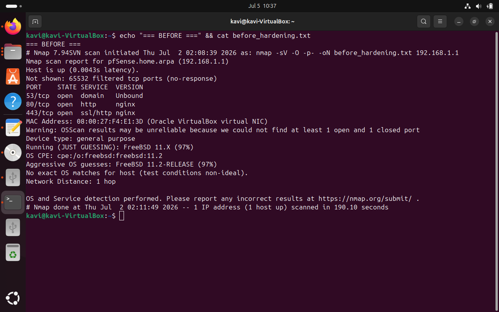
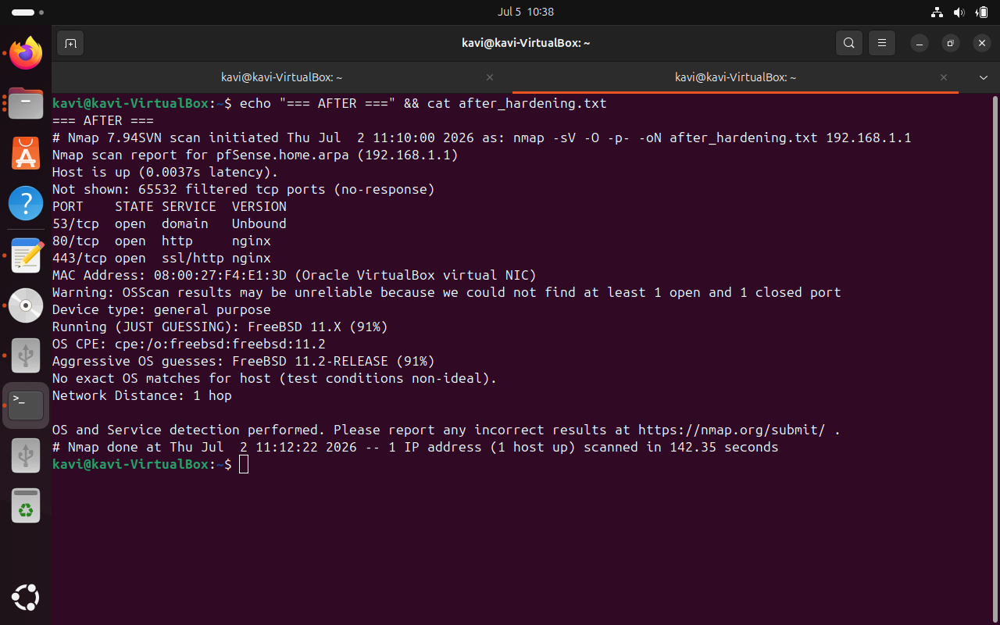

# 🔐 Project 1 — Home Network Security Lab & Hardening


## 📋 Overview

Built a segmented virtual network simulating an enterprise
environment using pfSense, Ubuntu Server, and Windows 10 VMs
on VirtualBox. Conducted a full security audit using Nmap,
identified real vulnerabilities in the default configuration,
and applied structured hardening controls.

This project demonstrates:
- Network segmentation and firewall configuration
- Vulnerability identification via active scanning
- Security hardening using CIS benchmark principles
- Before/after evidence collection and documentation

---

## 🏗️ Network Architecture
Internet (VirtualBox NAT)
│
▼
┌─────────────────────────┐
│   pfSense Firewall VM   │
│  WAN: 10.0.2.15 (DHCP) │
│  LAN: 192.168.1.1/24   │
│  Roles: Firewall, DHCP, │
│  DNS, NAT, Router       │
└─────────┬───────────────┘
│ LabNet (Internal Network)
│ 192.168.1.0/24
┌─────┴──────┐
▼            ▼
┌────────┐  ┌──────────┐
│ Ubuntu │  │ Windows  │
│ Server │  │  10 VM   │
│.100    │  │  .101    │
└────────┘  └──────────┘

> All VMs run on VirtualBox on a Windows 11 host (16GB RAM)

### pfSense Roles in This Lab
This project includes documentation of all five simultaneous
roles pfSense plays in an enterprise-style network:

- 🛡️ **Gatekeeper** — edge firewall blocking unsolicited traffic
- 📡 **DHCP server** — automatic IP assignment to internal VMs
- 🔥 **Traffic filter** — allow/block rules per interface
- 🌐 **DNS resolver** — name resolution via Unbound (port 53)
- 🔄 **NAT router** — internet sharing with private IP hiding

---

## 🛠️ Tools Used

| Tool | Version | Purpose |
|---|---|---|
| VirtualBox | 7.x | Hypervisor — runs all VMs |
| pfSense | 2.6.0 | Firewall/Router VM |
| Nmap | 7.94 | Network scanning and audit |
| Ubuntu Server | 22.04 LTS | Internal server VM / scan host |
| Windows 10 | — | Internal client VM |
| draw.io | Web | Network diagram creation |

---

## 🔍 Security Findings (Before Hardening)

Nmap scan command used:
```bash
sudo nmap -sV -O -p- 192.168.1.1 -oN before_hardening.txt
```

| Finding | Severity | Port | Details |
|---|---|---|---|
| Default credentials | 🔴 Critical | N/A | admin/pfsense publicly known |
| Plain HTTP admin access | 🟠 Medium | 80 | Credentials sent in cleartext |
| IPv6 exposed on WAN | 🟡 Low | N/A | Unnecessary attack surface |
| OS fingerprint confidence | 🟡 Low | N/A | FreeBSD identified at 97% |

**Before hardening scan results:** see [scans/before_hardening.txt](./scans/before_hardening.txt)



---

## 🔒 Hardening Steps Applied

### Step 1 — Change Default Credentials 🔴 Critical
- Changed admin password from default `pfsense`
- Most common cause of firewall compromise in real organisations
- Reference: CIS Benchmark Control 5.2

### Step 2 — Force HTTPS Only 🟠 Medium
- Changed webConfigurator protocol: HTTP → HTTPS
- Port 80 now serves 301 redirect to HTTPS only
- Admin credentials now always encrypted in transit
- Reference: CIS Benchmark Control 9.2

### Step 3 — Add HTTP Block Firewall Rule 🟠 Medium
- Added LAN rule: Block TCP → This Firewall → Port 80
- Prevents HTTP pass-through traffic to admin panel
- Defense in depth: two layers protecting same risk

### Step 4 — Disable IPv6 🟡 Low
- Disabled IPv6 in System → Advanced → Networking
- Removes unnecessary protocol from attack surface
- IPv6 address previously visible on WAN interface

### Step 5 — Confirm SSH Disabled 🟡 Low
- Verified SSH is disabled in Admin Access settings
- Remote command-line access to firewall not permitted
- Management only via HTTPS web dashboard from LAN

---

## 📊 Results (After Hardening)

Nmap scan command used:
```bash
sudo nmap -sV -O -p- 192.168.1.1 -oN after_hardening.txt
```

| Finding | Before | After | Improvement |
|---|---|---|---|
| Default credentials | 🔴 Exposed | ✅ Changed | Critical risk eliminated |
| Port 80 behaviour | 🟠 Serving plaintext HTTP | ✅ HTTPS redirect only | Credential interception prevented |
| IPv6 on WAN | 🟡 Visible | ✅ Eliminated | Attack surface reduced |
| OS fingerprint | 🟡 97% confidence | ✅ 91% confidence | Harder to fingerprint |
| SSH access | Disabled | Confirmed disabled | Remote access blocked |

**After hardening scan results:** see [scans/after_hardening.txt](./scans/after_hardening.txt)



---

## 📸 Evidence

| Evidence | Location |
|---|---|
| Before hardening Nmap scan | [scans/before_hardening.txt](./scans/before_hardening.txt) |
| After hardening Nmap scan | [scans/after_hardening.txt](./scans/after_hardening.txt) |
| LAN firewall rules screenshot | [Screenshots/Lan.jpg](./Screenshots/Lan.jpg) |
| WAN firewall rules screenshot | [Screenshots/Wan.jpg](./Screenshots/Wan.jpg) |
| pfSense dashboard before | [Screenshots/pfsense_dashboard 1.png](./Screenshots/pfsense_dashboard%201.png) |
| pfSense dashboard after | [Screenshots/pfsense_dashboard 2.png](./Screenshots/pfsense_dashboard%202.png) |
| Firewall rules documentation | [configs/firewall_rules.md](./configs/firewall_rules.md) |
| Sanitized pfSense config | [configs/pfsense-config.xml](./configs/pfsense-config.xml) |

---

## 📚 Key Lessons Learned

12 lessons documented covering real mistakes made and 
concepts discovered during hands-on work.

**Highlights:**
- Security tools require root privileges for raw packet access
- Default credentials are Priority 1 hardening target
- Port behaviour and port closure are different security controls
- Firewall rules and local service config protect different traffic
- Config files contain hidden secrets — always sanitize before publishing
- Security hardening is about layers, not perfection

➡️ Full documentation: [lessons_learned.md](./lessons_learned.md)

---

## 🎯 Skills Demonstrated

Network Security          ████████████████░░░░  Intermediate
Firewall Configuration    ████████████████░░░░  Intermediate
Nmap Scanning             ████████████░░░░░░░░  Foundational
Linux Administration      ████████████░░░░░░░░  Foundational
Security Documentation    ████████████████░░░░  Intermediate
Risk Assessment           ████████████░░░░░░░░  Foundational
Defense in Depth          ████████████████░░░░  Intermediate

**Standards referenced:**
- CIS Benchmarks (hardening guidance)
- NIST 800-53 (security controls framework)
- NIST 800-61 (incident response reference)

---

## 🔜 What's Next

This is **Project 1 of 11** in my cybersecurity portfolio.

**Project 2:** SIEM Deployment and Log Analysis with Wazuh
- Deploy Wazuh SIEM and connect Ubuntu/Windows agents
- Write custom detection rules for brute force and port scans
- Build alert triage workflow documentation

**Full roadmap:** [github.com/kamalanathankaviprasath-cyber](https://github.com/kamalanathankaviprasath-cyber)

---

*Built by Kamalanathan Kaviprasath*
*IT Support Professional transitioning into Cybersecurity*
*📍 Colombo, Sri Lanka*
